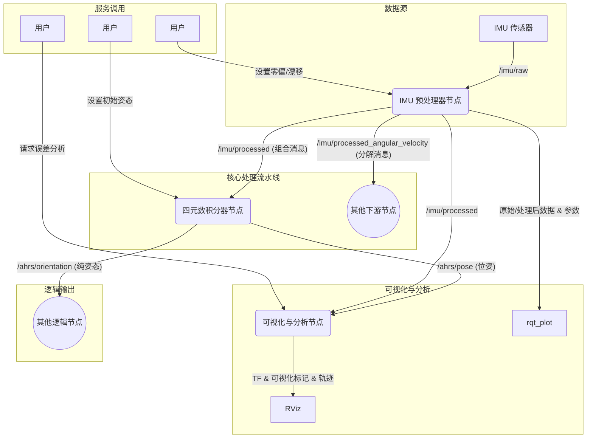

# IMU 算法可视化 - 四元数积分器

## 项目目标
本项目旨在开发一个基于 IMU 的四元数积分与可视化系统，该系统具有高鲁棒性、高透明度和模块化特性。其架构设计考虑了未来的可扩展性，以便集成先进的 IMU 预处理技术，并通过丰富的可视化工具集和清晰的模块化接口提供深入的洞察力。

## 架构概览
系统由三个主要的 ROS 节点组成，形成清晰的处理与可视化流水线：
1.  **IMU 预处理器节点：** 负责清洗和优化原始 IMU 数据，并以组合和分解两种形式发布处理结果，同时提供数据质量监控的可视化接口。
2.  **四元数积分器节点：** 使用经过处理的 IMU 角速度执行直接四元数积分，并以纯净的姿态和完整的位姿两种形式发布结果。
3.  **可视化与分析节点：** 在 RViz 中全面可视化积分后的姿态、运动轨迹和关键物理量，并提供误差分析服务。

## 信息流

*   **IMU 预处理器节点:** 订阅原始数据，进行预处理。它发布一个完整的 `/imu/processed` (`sensor_msgs/Imu`) 消息，并为需要更具体数据的下游节点额外发布分解后的 `/imu/processed_angular_velocity` 和 `/imu/processed_linear_acceleration` 话题。
*   **四元数积分器节点:** 订阅 `/imu/processed`。它的核心输出是纯净的姿态信息 `/ahrs/orientation` (`geometry_msgs/QuaternionStamped`)。同时，为了方便 RViz 等工具直接使用，它也发布一个包含姿态和（漂移的）位置的 `/ahrs/pose` (`geometry_msgs/PoseStamped`) 话题。
*   **可视化与分析节点:** 订阅 `/ahrs/pose` 和 `/imu/processed`，将其转换为丰富的 RViz 可视化元素。
*   **RViz & rqt_plot:** 最终的可视化工具。`rqt_plot` 用于二维图表分析，`RViz` 用于三维空间状态呈现。

## 节点详情与 API (输入/输出)

| 节点名称 | 目的 | 输入话题 (类型) | 输入服务 (类型) | 输出话题 (类型) | 输出 (可视化/服务) |
|---|---|---|---|---|---|
| **IMU 预处理器节点** | 对原始 IMU 数据进行校正和滤波，并以多种形式发布。 | `/imu/raw` (`sensor_msgs/Imu`) | `set_bias_drift` (`quaternion_integrator/SetBiasDrift`) | **组合输出:** `/imu/processed` (`sensor_msgs/Imu`) **分解输出:** `/imu/processed_angular_velocity` (`Vector3Stamped`) `/imu/processed_linear_acceleration` (`Vector3Stamped`) **监控输出:** `/imu/bias_params` (`Vector3`) | **通过 `rqt_plot`:** - 对比 `/imu/raw` 和 `/imu/processed` 的数据。 - 监控当前的零偏参数。 |
| **四元数积分器节点** | 通过积分角速度计算姿态，并以两种形式发布。 | `/imu/processed` (`sensor_msgs/Imu`) | `set_attitude` (`quaternion_integrator/SetAttitude`) | **核心输出:** `/ahrs/orientation` (`QuaternionStamped`) **可视化输出:** `/ahrs/pose` (`PoseStamped`) | 无 |
| **可视化与分析节点** | 在 RViz 中全面可视化系统状态。 | `/ahrs/pose` (`PoseStamped`) `/imu/processed` (`Imu`) | `get_error_with_ground_truth` (`GetErrorWithGroundTruth`) | 无 | **通过 `RViz`:** - `tf` 变换。 - `visualization_msgs/Marker` (姿态、角速度向量、误差文本)。 - `nav_msgs/Path` (运动轨迹)。 - 通过服务响应提供误差分析。 |

## 预期效果
通过本项目的实施，我们将能够：
*   **实现高度模块化：** 下游节点可以根据需求订阅高度相关的具体信息，而不是宽泛的组合信息，降低耦合度。
*   **提升系统透明度：** 通过 `rqt_plot` 和 `RViz` 的结合，直观监控从原始数据到最终姿态的全过程。
*   **增强调试能力：** 实时对比预处理前后数据、观察角速度向量、追踪运动轨迹和量化误差，能快速定位问题。
*   **清晰地分离** 数据处理、核心算法和可视化模块，提高代码的可维护性和可扩展性。
*   为未来引入更复杂的 IMU 误差补偿算法**奠定坚实基础**。
*   通过服务接口**动态调整**参数，并**即时观察**其在可视化工具中的效果，增强系统的交互性。
